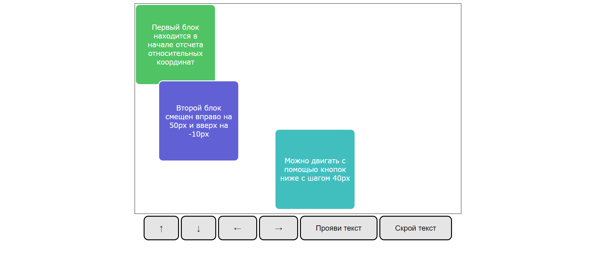
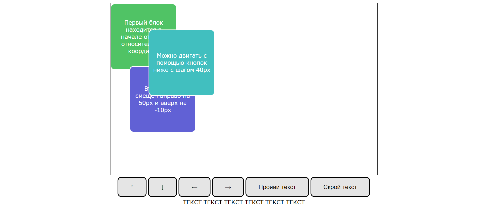

# Task 5
Создан средствами ```CSS``` и ```JavaScript``` документ заданного вида, содержащий 3 блока, один из которых можно передвигать, и 6 кнопок: 4 для передвижения блока и 2 для текста, который может проявляться. Блок двигается с помощью изменения координат в ```position: relative```, текст проявляется и исчезает с помощью изменения параметра ```visibility```. 

