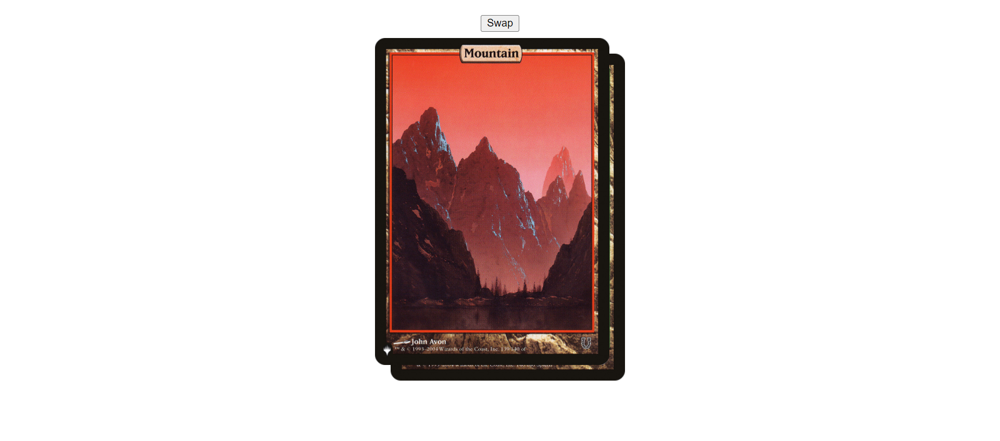
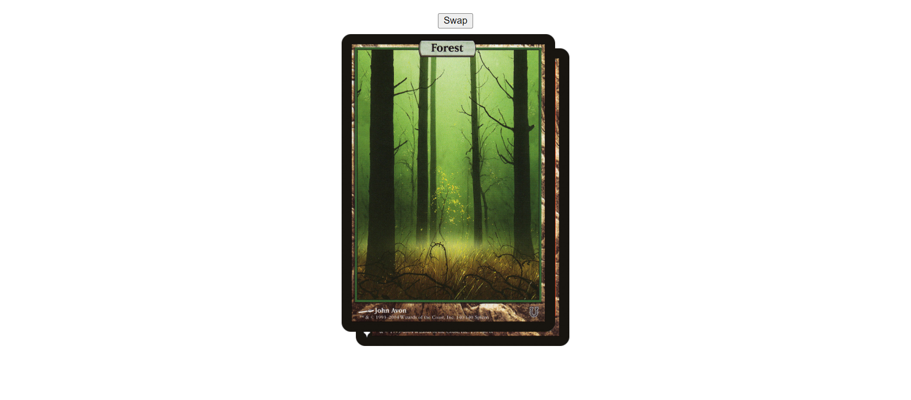

# Task 7

Реализована кнопка, которая меняет картинки местами посредством вызовов функций движения и изменения ```z-index``` параметра изображений.

Движение осуществляется изменением параметра ```style.left``` и ```style.top``` для объектов с ```position: absolute```. Повторный вызов через ```setTimeOut(...)```.

Из-за того, что размер экрана у разных устройст различен, прилагаю скриншоты:

