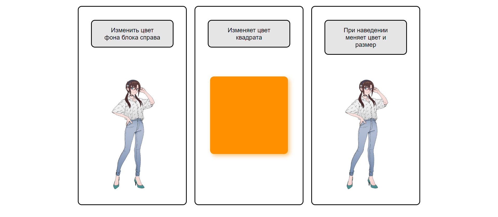
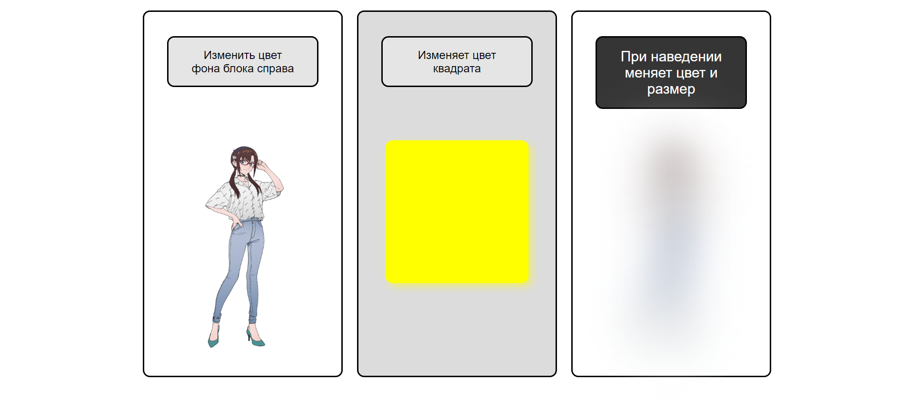

# Task 8
Реализовано меню, соостоящее из трех блоков с кнопками: кнопка 1 меняет цвет фона второго блока, кнопка 2 меняет цвет квадрата во втором блоке, кнопка 3 ставит и убирает блюр с картике в третьем блоке, также также она увеличивается и меняет цвет при наведении. Реализовано на основе предыдущих заданий и с использованием ```filter: blur(...px)```, аналогично [Task 9](https://github.com/astatochek/Mat-Mech_Sys_Prog_4th_Sem/tree/main/CSS/Task%209)

