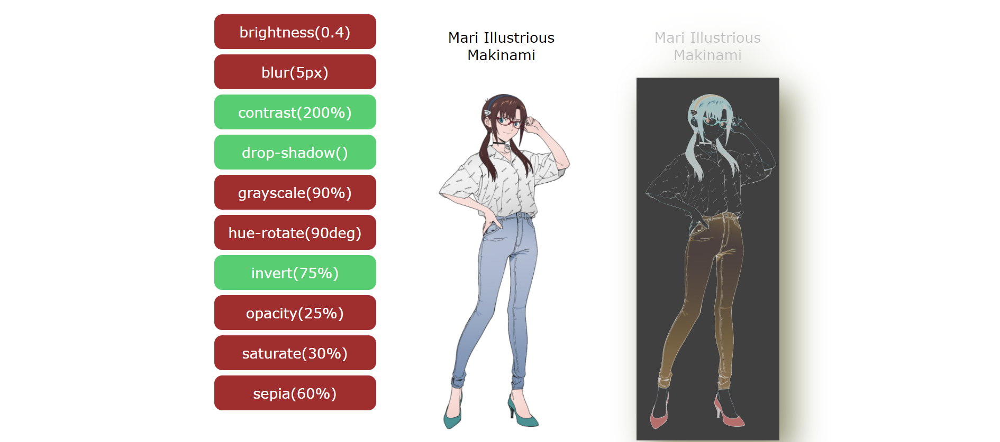

# Task 9

Реализована меню фильтров, которые применяются ко второму из двух идентичных блоков с изображением и текстом. В скрипте прописан список возможных фильтров и будевой массив для хранения примененных. При нажатии на кнопку, в последнем массиве изменяется значение выбранного элемента на обратный, затем применяются все выбранные на данный момент фильтры.

Пример работы:
