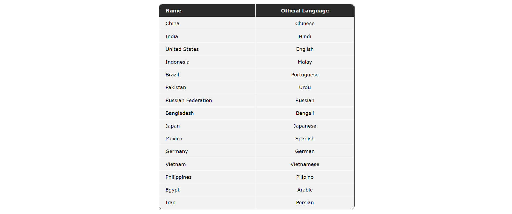
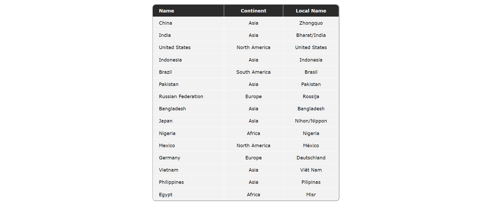

# Task 3
Продолжим работу с той же базой данных, однако теперь будем обращаться еще и к таблице ```country```.

* В файле ```index.php``` подключимся к базе данных:
```php
$server = 'localhost';
$user = 'root';
$pass = 'root';
$conn = new PDO('mysql:host=localhost;dbname=world', $user, $pass);
```
* Сделаем запрос: выведем страны и их официальные языки в порядке убывания численности населения
```cmd
SELECT country.Name, countrylanguage.Language FROM `country`, `countrylanguage` WHERE countrylanguage.IsOfficial = 'T' AND countrylanguage.CountryCode = country.Code ORDER BY country.Population DESC LIMIT 15;
```

* Сделаем запрос: выведем те же страны в таком же порядке, но тепер кроме имени также будут столбцы континент и локальное название
```cmd
SELECT Name, Continent, LocalName FROM country ORDER BY Population DESC LIMIT 15;
```

