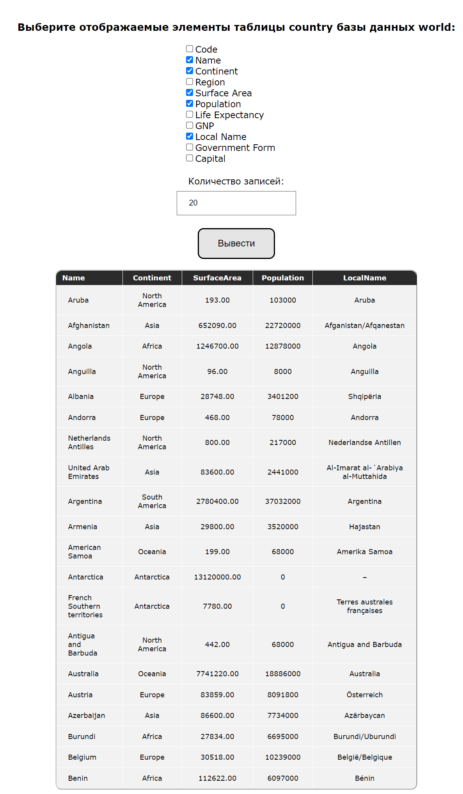
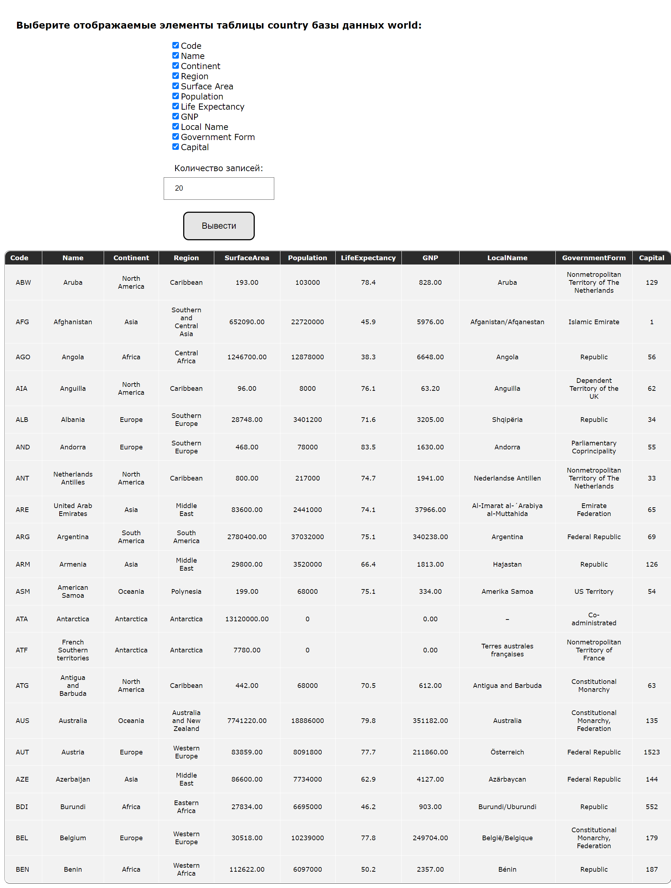

# Task 4
Реализовано меню для вывода выбранных элементов таблицы ```country``` базы данных ```world```.

При нажатии кнопки, на основе выбранных элементов и введенного числа создается строка, подающаяся как запрос, вывод аналогичен заданию 3.

Примеры работы:

