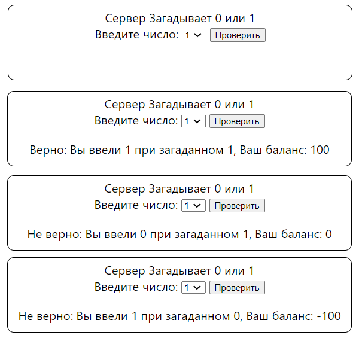

# Задание 3

Реализована игра с сервером. При заходе на страницу ```index.php``` генерируется случайный ответ и записывается в массив ```$_SESSION``` туда же записывается и переменная ```balance```, которая считает текущий баланс игрока. Пользователю необходимо выбрать 1 или 0 в форме и нажать кнопку. Сервер выводит ответ: верно, если выбор пользователя совпал с загаданным сервером числом, тогда к балансу прибавляется 100, иначе - наоборот, затем сервер обновляет загаданное число через:
```php
$_SESSION["ans"]=rand(0,1);
```
### Пример работы
##### (коллаж)
