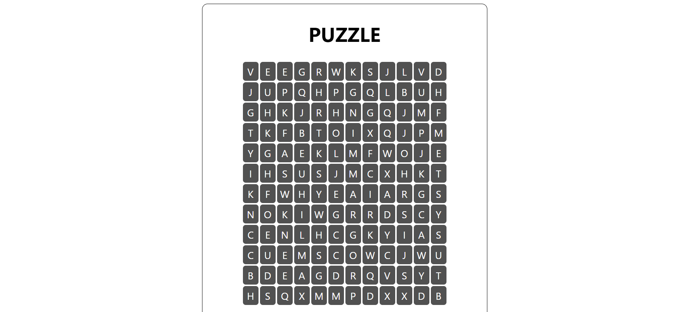

# Задание 4

На странице ```index.php``` находится форма, которую необходимо заполнить пользователю, вводится высота и ширина талицы пазла, а также слова, которые нужно будет найти. Данные передаются на страницу ```puzzle.php```.

Функция ```getInput()``` создает массив слов из написанных в ```textarea```.  Функция ```putDots()``` создает двумерный массив заданного размера, заполненный точками. Функция ```addWord()``` добавляет в поле слово, если это возможно. Функция ```fillWithLetters()``` идет по массиву слов и для каждого применяет функцию ```addWord()```.  Далее функция ```createBoard()``` создает из массива html таблицу. Функция ```fillExtraSpace()``` заполняет еще не заполненные клетки поля случайными буквами.  Функция ```printPuzzle()``` выводит таблицу.

На странице ```puzzle.php``` пользователь видит готовое поле и список слов, которые необходимо найти. Нажав на кнопку, пользователь перейдет на страницу ```answers.php```, где представлено решение (исходная таблица, в которой буквы стоят только для загаданных слов). 

### Пример работы:



